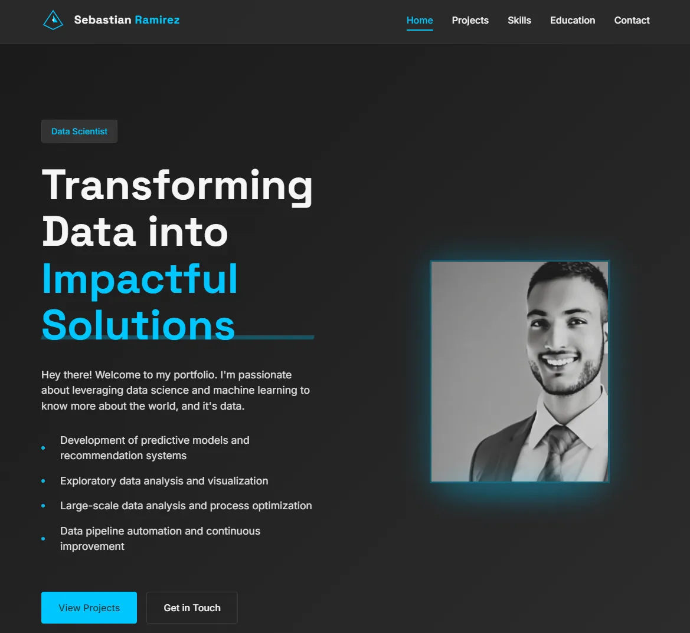

# Portfolio Website

A modern, responsive portfolio website showcasing projects and skills, for data scientists, machine learning engineers, and data analysts.



## Overview

This portfolio website is designed to present professional work and technical skills in a visually appealing way. It features a modern UI with smooth animations, responsive design, and project filtering capabilities. The website includes detailed project pages that showcase technologies, features, and metrics for each individual project.

## Features

- **Responsive Design**: Fully adapts to all device sizes from mobile to desktop
- **Dynamic Project Showcase**: Filter projects by category (ML, NLP, LLM, etc.)
- **Detailed Project Pages**: Individual pages for each project with complete information
- **Performance Optimized**: Fast loading with preloaded critical assets
- **Smooth Animations**: Subtle animations enhance user experience without slowing down the site
- **SEO Ready**: Includes meta tags and schema markup for better search engine visibility
- **Accessible**: Built with accessibility best practices
- **Dark Mode**: Modern dark UI theme with accent colors
- **Contact Section**: Easy way for visitors to reach out

## Technologies Used

- **HTML5**: Semantic markup structure
- **CSS3**: 
  - Custom CSS properties for consistent theming
  - CSS Grid and Flexbox for responsive layouts
  - Media queries for device adaptation
  - CSS animations and transitions
- **JavaScript**: 
  - ES6+ features
  - DOM manipulation
  - Smooth scrolling
  - Dynamic content loading
  - Project filtering
- **No frameworks or libraries**: Built with vanilla HTML, CSS, and JavaScript for optimal performance

## Project Structure

```
portfolio-ws/
│
├── assets/                # Images and media files
│   ├── bank-complaints.webp
│   ├── telegram.webp
│   ├── forex.webp
│   └── ...
│
├── css/                   # Stylesheet files
│   ├── components/        # Component-specific styles
│   │   ├── nav.css
│   │   ├── cards.css
│   │   ├── forms.css
│   │   └── project-detail.css
│   │
│   ├── main.css           # Main stylesheet
│   └── utilities.css      # Utility classes
│
├── js/                    # JavaScript files
│   ├── animations.js      # Animation logic
│   ├── main.js            # Main functionality and projects data
│   └── project-detail.js  # Project detail page functionality
│
├── index.html             # Home page
├── project-detail.html    # Project detail page template
└── README.md              # This documentation file
```

## Installation & Setup

1. **Clone the repository**:
   ```
   git clone https://github.com/sebasr0/portfolio-ws.git
   cd portfolio-ws
   ```

2. **Local Development**:
   - Open the `index.html` file in your browser, or
   - Use a local development server like Live Server in VSCode
   - Alternatively, use any HTTP server:
     ```
     # Using Python
     python -m http.server
     ```

3. **Deployment**:
   - Deploy to any static hosting service like GitHub Pages, Netlify, Vercel, or any web hosting provider
   - No build step required as this is a static site

## Usage

### Adding New Projects

To add a new project to the portfolio, follow these steps:

1. Add your project details to the `projects` array in `js/main.js`:

```javascript
{
    id: 'your-project-id',
    title: 'Your Project Title',
    description: 'Brief description of your project.',
    image: 'assets/your-project-image.webp',
    category: 'your-category', // e.g., 'ml', 'nlp', 'llm'
    technologies: ['Tech 1', 'Tech 2', 'Tech 3'],
    link: 'https://yourlivedenolink.com' // Optional
}
```

2. Add detailed project information in `js/project-detail.js` within the `projectsData` object:

```javascript
'your-project-id': {
    title: 'Your Project Title',
    category: 'your-category',
    description: `Detailed multi-paragraph description of your project.
    
    Second paragraph with more details.
    
    Third paragraph about implementation or challenges.`,
    image: 'assets/your-project-image.webp',
    technologies: ['Tech 1', 'Tech 2', 'Tech 3', 'Tech 4', 'Tech 5'],
    features: [
        'Feature 1 description',
        'Feature 2 description',
        'Feature 3 description'
    ],
    metrics: [
        {
            value: '95%',
            label: 'Some Relevant Metric'
        },
        {
            value: '100+',
            label: 'Another Metric'
        }
    ],
    demoUrl: 'https://yourlivedenolink.com', // Optional
    sourceUrl: 'https://github.com/yourusername/your-project' // Optional
}
```

3. Add your project image to the `assets/` directory (use .webp format for best performance)

### Customizing Content

1. **Personal Information**: Update your name, title, and personal links in the `index.html` file
2. **Skills**: Modify the skills section in `index.html` to reflect your technical abilities
3. **Social Links**: Update the social media and contact links in the footer of both HTML files
4. **Schema Markup**: Update the schema markup in the head of `index.html` with your information

### Customizing Styles

1. **Colors**: Main color variables are defined at the top of `css/main.css`:
   ```css
   :root {
     --color-background: #121212;
     --color-text: #e0e0e0;
     --color-accent: #64ffda;
     --color-secondary: #ffffff;
     /* ... other variables ... */
   }
   ```

2. **Typography**: Font families and sizes are also defined as CSS variables

3. **Spacing**: Spacing variables ensure consistent layout throughout the site

## License

This project is available under the MIT License. Feel free to use, modify, and distribute the code for personal or commercial projects.

## Credits

- Designed & Developed by [Sebastian Ramirez](https://github.com/sebasr0)
- Fonts: Space Grotesk and Inter from Google Fonts
